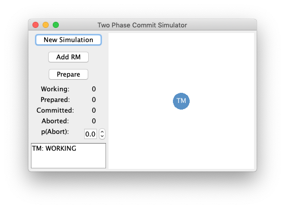
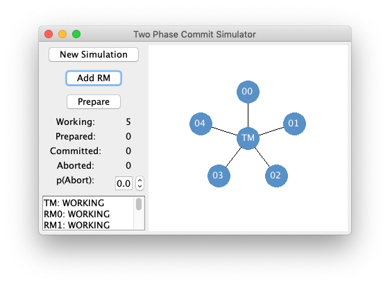
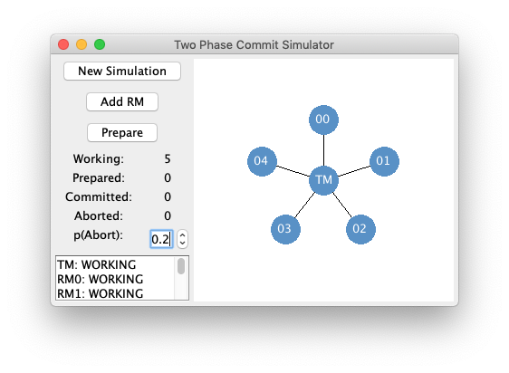
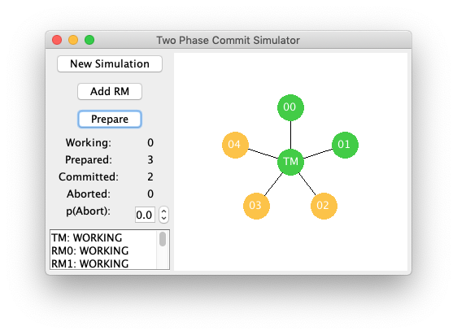

# Two Phase Commit Simulator

This is a Java multithreaded application I built for Dr. Aravind's class "CPSC 441: Distributed Systems" at University of Northern British Columbia.  Its purpose is to provide an interactive, visual representation of the two-phase commit algorithm for transaction consensus. 

The processes in the simulated distributed system run on their own threads and communicate with one another solely through message-passing.  The system is visualized as an undirected, connected graph.

## Running/Compiling

A `.jar` file is included and should be used to test the program.  An ant build script (`build.xml`) is also included.

### Adding Resource Managers

The program can simulate a transaction for an arbitrarily large distributed system (with one coordinating node, which is the **Transaction Manager** or **TM**).  To add a resource manager node to the system, click the *Add RM* button.  One can add as many nodes as ones likes, although one should be aware that each node runs on its own thread.

### Changing Abort Probability

When we want to commit to a transaction across all nodes in a distributed system, we need to first verify that every node is able to commit.  The *p(Abort)* spinner indicates the probability that each node, when asked to commit to a transaction, will not be able to do so and will instead enter the **Aborted** state.

By default, the probability is set to 0.  Using the spinner, a user can set this probability in increments of 0.1 from 0.0 to 1.0.

### Initiating a Transaction

The *Prepare* button tells the system to try to commit to a transaction.
* If every node is able to successfully enter the **Prepared** state, then every node will eventually end up in the **Committed** state.
* If at least one node enters the **Aborted** state, then eventually every node will end up in the **Aborted** state.

The numbers on the left side of the window indicate how many nodes are in each state, and the log in the bottom left displays the events in the system.  Both update in real time as the simulation progresses.

The graphical display on the right also updates in real time.  As one can easily see when running the program, nodes change color according to their current state:
* Blue = **Working**
* Yellow = **Prepared**
* Green = **Committed**
* Red = **Aborted**

The log area at the bottom left of the window keeps a real-time list of the events that have occurred in the system, and can be copied and saved.

### Resetting the Simulation

After a simulation has completed and all nodes are either **Committed** or **Aborted**, the user can press the *New Simulation* button to return to a blank slate with only a Transaction Manager process present.  In this manner, one can change variables and repeat simulations as many times as one desires.  Please note that the log area is cleared during a reset; any log data present will be lost if it is not copied to an external file.

